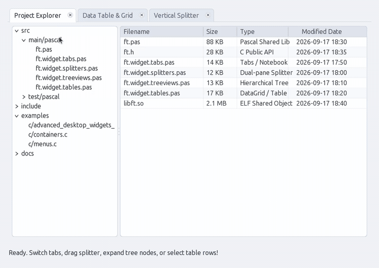
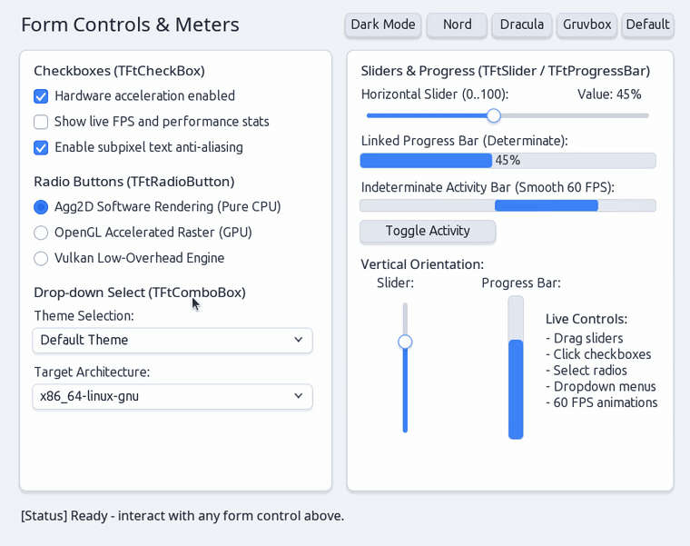
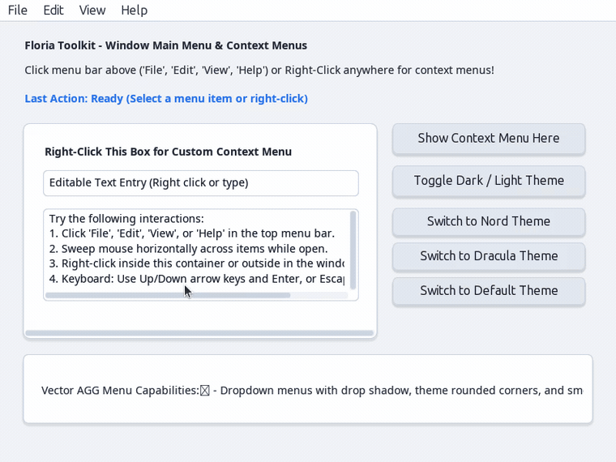
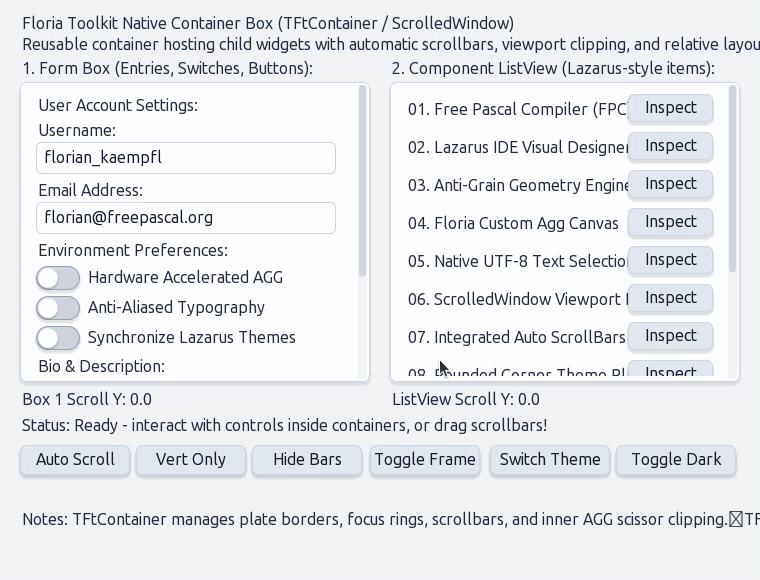
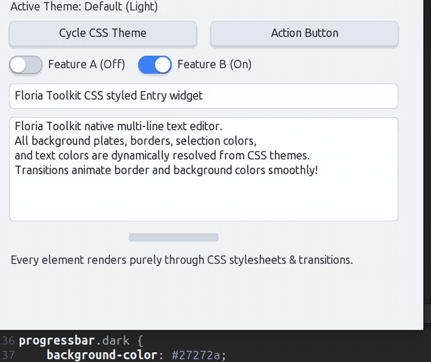
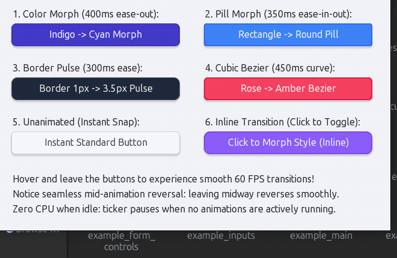

# Floria Toolkit (`Ft`)

A lightweight, high-performance native GUI toolkit engineered with Free Pascal, Anti-Grain Geometry (`AGG`) subpixel vector rendering, modern CSS theming, smooth 60 FPS transitions, and a clean C ABI for universal language interoperability (C, C++, Python, Rust, Zig, Go).

> **Why "Floria"?**  
> The name **Floria** pays tribute to Free Pascal creator **Florian Klämpfl**.  
> The short moniker is **`Ft`**, pronounced **"Feat"**.

---

## Highlights

- **Subpixel Vector Rendering (AGG)**:
  - Subpixel-accurate antialiasing for vector curves, text, and surfaces.
  - True 2D Gaussian drop shadows with configurable offsets, blur, and opacity.
  - Subpixel gamma-corrected font rendering and native display DPI scaling.
  - Raster bitmap decoding and scalable vector SVG asset rendering (`TFtImage`).
- **Pure CSS Theming Engine**:
  - Standards-based `.css` stylesheets powered by `Floria.CSS` from `florialib`.
  - First-class `:root` CSS custom properties (`var(--token)`) with automatic cascading and baseline defaults fallback.
  - Bundled themes: **Default** (Breeze/Fusion), **Nord**, **Dracula**, **Gruvbox**, **GTK2**, and **Classic**.
  - First-class **Light & Dark mode** with runtime hot-swapping and multi-window broadcasting.
  - Full support for element selectors, class selectors (`.dark`), ID selectors (`#id`), and pseudo-classes (`:hover`, `:active`, `:focus`, `:checked`, `:disabled`).
- **CSS Transitions & Animation**:
  - Smooth 60 FPS state transitions (e.g. hover effects, dark mode switches, window caption button glowing halos) with easing functions (`ease`, `ease-in`, `ease-out`, `ease-in-out`, `linear`).
- **Modern Desktop Widgets**:
  - **Window (`TFtWindow`)**: Platform-agnostic window abstraction with double-buffered vector rendering (`AGG`), dirty rectangle tracking, and pluggable platform backends (`TFtX11Window` on X11/XCB, WinAPI for Windows, Cocoa for macOS, Wayland).
  - **Window Button (`TFtWindowButton`)**: Titlebar and tab caption buttons (Close, Minimize, Maximize/Restore, Custom) with OS styles (Mac, GTK, Windows), glowing radial hover transitions, and dark mode adaptation.
  - **Button & Toggle Button**: Interactive push and latching buttons with hover transitions.
  - **Switch**: Modern toggle switch with circular thumb slider and accent highlights.
  - **CheckBox**: Crisp vector checkboxes with checkmark glyph and keyboard toggle.
  - **RadioButton**: Mutually exclusive options with grouping support and circular indicator.
  - **ComboBox**: Dropdown selection menu with popup list and optional editable entry.
  - **Slider**: Horizontal and vertical continuous or stepped sliders with dragging and keyboard arrows.
  - **ProgressBar**: Determinate percentage progress and 60 FPS indeterminate animated activity bar.
  - **Text / Label (`TFtText`)**: Dual-mode text with selectable mouse-drag highlight, clipboard copy, multiline word wrapping, and bounds clipping.
  - **Entry**: Single-line text input with blinking caret, selection, and clipboard support.
  - **TextArea**: Multi-line text area with line navigation and dynamic scrollbars.
  - **Notebook & Tabs (`TFtNotebook`, `TFtTabs`)**: Tabbed multi-page containers with close buttons, active tab indicators, and page switching.
  - **Splitter (`TFtSplitter`)**: Resizable dual-pane container with horizontal or vertical splitter bar, grip handle, and live mouse dragging.
  - **TreeView (`TFtTreeView`)**: Hierarchical tree viewer with expand/collapse vector carets, arbitrary node nesting, and selection tracking.
  - **Table / DataGrid (`TFtTable`, `TFtGrid`)**: Multi-column tabular data grid with column headers, text alignment, zebra striping, cell selection, and multi-row selection (`Ctrl`/`Shift` multi-select).
  - **Image (`TFtImage`)**: Raster image decoding (BMP, PNG, JPG) and scalable vector SVG rendering with scaling modes (`fit`, `fill`, `stretch`, `center`).
  - **ScrollBar**: Standalone vector scrollbars with proportional thumb sizing and drag physics.
  - **Container**: Scrolled viewport frame with automatic scrollbars and AGG scissor clipping.
- **Desktop-First Ergonomics & Productivity**:
  - Unapologetically desktop-first: dense data layouts, high-precision cursor interactions, menu bars, dockable splitters, and persistent scrollbars (no tablet/mobile hybrid compromises).
  - Full keyboard focus traversal (`Tab` / `Shift+Tab`) with theme focus rings and mnemonic accelerators.
- **First-Class X11 & Pluggable Backends**:
  - Premier native X11/XCB integration with microsecond event dispatch, EWMH window management, and compositor blur protocols.
  - Pluggable `TFtWindow` abstraction ready for future WinAPI, Cocoa, and Wayland backends.
- **Universal C ABI & Rock-Solid Stability**:
  - Standalone shared library (`libft.so`) exposing a frozen, append-only C ABI via `include/ft.h`.
  - Adopts the **Windows API standard of stability**: zero ABI churn between minor releases, opaque pointer handles, and permanent backward compatibility across language bindings (C, C++, Python, Rust, Zig, Go, Pascal).

---

## Documentation

Comprehensive documentation is available in the [`docs/`](docs/) directory:

- 📖 **[C API Reference](docs/api-reference.md)**: Complete function listings, signatures, and descriptions for all toolkit APIs.
- 🎨 **[Theming & CSS Guide](docs/theming.md)**: Guide to writing CSS stylesheets, selectors, properties, transitions, and dark mode.
- 🧱 **[Widgets Architecture](docs/widgets.md)**: Widget hierarchy, coordinate systems, container clipping, and design patterns.
- 🏗️ **[Architecture & Internals](docs/architecture.md)**: Overview of the AGG graphics pipe, X11 backend, animation scheduler, and FFI layer.
- 💡 **[Design Rationale & Invariants](docs/design-rationale.md)**: Desktop-first philosophy, first-class X11 priority, Win32-grade ABI stability (avoiding GTK churn), and compositor integration invariants.

---

## Visual Showcase

### Advanced Desktop Widgets

*Multi-tab Notebook with close buttons and glowing halos, dual-pane Splitters with live dragging, hierarchical TreeView with expander arrows, and multi-column Data Table with selection and zebra striping.*

### Form Controls & Meters

*Interactive CheckBoxes, RadioButtons, ComboBox dropdowns, live Slider dragging, and smooth 60 FPS indeterminate progress bar.*

### Window Main Menu & Pop-up Context Menus

*Window Main Menu bar with hover sweep tracking, cascading submenus with subtle vector chevrons, checkmarks, dynamic theming, and floating context menus.*

### Reusable Containers & Scrolled Viewports

*`TFtContainer` hosting heterogeneous child widgets with relative layout, dynamic render area conformance, auto scrollbars, and AGG viewport clipping.*

### Themes & Dynamic CSS Transitions

*Pure CSS theming engine with runtime hot-swapping between Default, Dark Mode, Dracula, Nord, Gruvbox, GTK2, and Classic themes.*

### 60 FPS CSS Transitions & Animations

*Smooth 60 FPS CSS transition engine showcasing color morphing, border radius morphing (rectangle to pill), pulsating border outlines, cubic-bezier timing functions, and dynamic inline style transitions with zero CPU usage when idle.*

---

## Quickstart

### C Example

```c
#include "ft.h"
#include <stdio.h>

static void on_btn_click(FtWidget widget, void* user_data) {
    printf("Button clicked! Data: %s\n", (const char*)user_data);
}

static void on_dark_toggle(FtWidget widget, int32_t checked, void* user_data) {
    ft_theme_set_dark_mode(checked);
}

int main(void) {
    ft_init();

    FtWidget win = ft_window_create(500, 320, "Floria Toolkit Quickstart");

    FtWidget btn = ft_button_create(win, 30, 40, 200, 44, "Click Me");
    ft_button_on_click(btn, on_btn_click, (void*)"SampleData");

    FtWidget sw = ft_switch_create(win, 30, 110, 200, 26, "Dark Mode");
    ft_switch_set_checked(sw, ft_theme_get_dark_mode());
    ft_switch_on_toggle(sw, on_dark_toggle, NULL);

    ft_widget_show(win);
    ft_main_loop();
    ft_quit();
    return 0;
}
```

### Python Example (`ctypes`)

```python
import ctypes

ft = ctypes.CDLL("./target/libft.so")
ft.ft_init()

win = ft.ft_window_create(400, 250, b"Python Floria App")
btn = ft.ft_button_create(win, 50, 50, 180, 40, b"Click Me")

# Hot-swap to Dracula theme with Dark Mode
ft.ft_theme_set(b"dracula")
ft.ft_theme_set_dark_mode(1)

ft.ft_widget_show(win)
ft.ft_main_loop()
ft.ft_quit()
```

---

## Building & Compiling

### Prerequisites
- **Free Pascal Compiler** (`fpc` 3.2.0+) or **PasBuild** / **Lazarus**
- **GCC** or **Clang** (for C examples)
- **Python 3** (for Python examples)
- **X11 Development Headers** (`libX11`, `libXext`)
- **fpgui-framework** (via PasBuild / fpcupdeluxe)

### 1. Build the Shared Library (`libft.so`)

Using **PasBuild**:
```bash
pasbuild compile
```
Or using **LazBuild**:
```bash
lazbuild src/main/pascal/ft.lpi
```

### 2. Build & Run C Examples

```bash
./build_examples.sh

# Run any example binary built in target/
./target/example_c_main
./target/example_c_advanced_desktop_widgets
./target/example_c_window_button
./target/example_c_form_controls
./target/example_c_menus
./target/example_c_containers
./target/example_c_css_button
./target/example_c_css_animation
```

### 3. Run Python Examples

```bash
python3 examples/python/app.py
python3 examples/python/fastfetch_ui.py
python3 examples/python/blur_showcase.py
python3 examples/python/terminal_transparency.py
```

---

## Directory Layout

```
floria-toolkit/
├── docs/                     # Detailed documentation & guides
│   ├── api-reference.md      # Full C API Reference
│   ├── theming.md            # CSS theming & transitions guide
│   ├── widgets.md            # Widget catalog & architecture
│   ├── architecture.md       # Graphics pipe & backend design
│   └── design-rationale.md   # Architectural invariants & design rationale
├── include/
│   └── ft.h                  # C/C++ API header
├── src/main/pascal/
│   ├── ft.pas                # Library entry point & C exports
│   ├── ft.window.pas         # Abstract window base class (TFtWindow), window factory & focus logic
│   ├── ft.css.pas            # CSS stylesheet engine, variable resolver & cascade
│   ├── ft.animation.pas      # Transition & animation interpolation engine
│   ├── ft.backend.x11.pas    # X11/XCB window backend & 60 FPS event loop (TFtX11Window)
│   ├── ft.backend.xcb.pas    # XCB backend compatibility wrapper
│   ├── ft.theme.pas          # Theme manager & stylesheet loader
│   ├── ft.widget.pas         # Base widget abstraction (uses florialib for vector canvas & fonts)
│   ├── ft.widget.buttons.pas # Push, toggle, and window caption buttons (TFtWindowButton)
│   ├── ft.widget.switches.pas# Animated toggle switch
│   ├── ft.widget.selectors.pas# CheckBox, RadioButton, ComboBox
│   ├── ft.widget.meters.pas  # Slider and ProgressBar
│   ├── ft.widget.texts.pas   # Selectable & static text labels with word wrapping & clipping
│   ├── ft.widget.entries.pas # Single-line text input
│   ├── ft.widget.textareas.pas# Multi-line text area
│   ├── ft.widget.scrollbars.pas# Scrollbar widget
│   ├── ft.widget.containers.pas# Container box & viewport
│   ├── ft.widget.tabs.pas    # Notebook & tabbed container (TFtNotebook, TFtTabs)
│   ├── ft.widget.splitters.pas# Resizable dual-pane splitter (TFtSplitter)
│   ├── ft.widget.treeviews.pas# Hierarchical tree view (TFtTreeView)
│   ├── ft.widget.tables.pas  # Tabular data grid with multi-row selection (TFtTable, TFtGrid)
│   ├── ft.widget.images.pas  # Raster image & SVG viewer (TFtImage)
│   └── ft.widget.menus.pas   # Main menu bar & popup menus
├── themes/                   # Bundled CSS theme stylesheets (*.css)
│   ├── default.css           # Modern Breeze/Fusion theme (with :root variables)
│   ├── nord.css              # Arctic frosty slate theme
│   ├── dracula.css           # Dracula dark theme
│   ├── gruvbox.css           # Retro warm Gruvbox theme
│   ├── gtk2.css              # Industrial GTK2 gray theme
│   └── classic.css           # Slate with emerald accents theme
├── examples/
│   ├── c/                    # C demo applications (*.c)
│   │   ├── advanced_desktop_widgets.c # Notebook, Splitter, TreeView, Table demo
│   │   ├── custom_table.c    # Multi-column table with multi-row selection
│   │   ├── window_button.c   # OS-styled window caption buttons & halos
│   │   ├── form_controls.c   # CheckBoxes, RadioButtons, ComboBox, Sliders
│   │   ├── menus.c           # Main menu bar & cascading submenus
│   │   ├── outside_menu.c    # Floating popup context menus
│   │   ├── widget_context_menus.c # Widget-attached right-click menus
│   │   ├── containers.c      # Dynamic containers & scrolled viewports
│   │   ├── container_render_area.c # Padding & custom render areas
│   │   ├── css_button.c      # Pure CSS styled buttons & hover effects
│   │   ├── css_animation.c   # 60 FPS CSS transitions & color morphing
│   │   ├── squircle_button.c # Superellipse squircle shaped buttons
│   │   ├── multilingual.c    # International Unicode text rendering
│   │   ├── chinese.c         # CJK font rendering showcase
│   │   ├── inputs.c          # Single-line entry & multiline text area
│   │   ├── scrollbars.c      # Standalone vector scrollbars
│   │   └── test_all_widgets_css.c # Comprehensive widget styling suite
│   └── python/               # Python ctypes applications (*.py)
│       ├── app.py            # Python quickstart application
│       ├── fastfetch_ui.py   # Desktop system info viewer GUI
│       ├── blur_showcase.py  # Window blur behind & elevation showcase
│       ├── opacity.py        # Alpha transparency & window opacity demo
│       ├── terminal_transparency.py # Translucent terminal mock-up
│       ├── svg_vector.py     # Scalable vector SVG graphics demo
│       ├── image_emoji.py    # Raster image decoding & emoji rendering
│       ├── multilingual.py   # Multi-language Python GUI
│       └── test_chinese.py   # CJK UTF-8 Python showcase
└── project.xml               # PasBuild package manifest (dependencies: florialib, fpgui-framework)
```

---

## Roadmap

Floria Toolkit is continuously evolving. High-priority initiatives include:

- **Pluggable Graphics Architecture (`TFtCanvas`)**:
  - Abstracting the vector canvas to support **Hardware-Accelerated GPU backends** (OpenGL / Vulkan) alongside **AggPas as the premier Software Fallback & Reference Engine** (ensuring zero-driver reliability in VMs, headless CI, and remote sessions).
- **X11 Desktop Environment & Window Manager (DE/WM)**:
  - First-class infrastructure for building an X11 Desktop Environment and Window Manager (comparable to KDE and GNOME): ICCCM/EWMH window reparenting, styled titlebars with `TFtWindowButton`, panels, docks, taskbars, application launchers, system tray, and compositing.
  - Cross-platform standalone app backends for Windows (Win32) and macOS (Cocoa).
- **Standard Dialogs & Modals**: Themed File Chooser, Directory Selector, Color Picker, and Alert/Confirmation dialogs (`ft_message_box`).
- **Typography & i18n**: HarfBuzz complex text shaping, BiDi support, and IME integration (`ibus` / `fcitx5`).
- **System Integration**: Cross-application drag-and-drop (XDnD) and desktop notification daemon integration.

See the complete [ROADMAP.md](ROADMAP.md) for full architectural details and technical milestones.

---

## License & Commercial Use

Floria Toolkit is open-source software licensed under the **[Mozilla Public License 2.0 (MPL-2.0)](LICENSE)**.  
Copyright (c) Floria Project / Dio Affriza.

### Developer & Linking Freedom (Static and Dynamic Linking)

Unlike viral copyleft licenses (such as GPL) or restrictive library licenses (such as LGPL with strict static linking caveats), the **MPL 2.0 is a file-level copyleft license specifically chosen to empower application developers**:

- **Static and Dynamic Linking Allowed**: You may freely link Floria Toolkit into your applications—either **statically** (e.g. bundled directly into a standalone binary) or **dynamically** (as a shared library `libft.so` / `libft.dll` / `libft.dylib`).
- **Keep Your Application Proprietary or Open Source**: The MPL 2.0 explicitly treats your application code as a "Larger Work". You are **not required** to release or open-source your own application code, business logic, or proprietary assets.
- **File-Level Copyleft**: The copyleft requirements apply solely to the source files of Floria Toolkit itself. If you modify any existing Floria Toolkit source files (`src/main/pascal/*`), you must make those modified Floria source files available under the MPL 2.0. Any new, separate files you author for your application remain entirely under your own license terms.
- **Commercial & Proprietary Friendly**: Floria Toolkit is fully suited for commercial products, closed-source enterprise software, indie games, open-source projects, and desktop environments alike.
