# Floria Toolkit (`Ft`)

A lightweight, high-performance native GUI toolkit engineered with Free Pascal, Anti-Grain Geometry (`AGG`) subpixel vector rendering, modern widget styling, and a clean C ABI for multi-language interoperability (C, C++, Python, Rust, Zig, Go).

> **Why "Floria"?**  
> The name **Floria** was chosen to pay tribute to Free Pascal (FPC) creator **Florian Klämpfl** — or perhaps I just ran out of ideas!  
> The short version is **`Ft`**, read and pronounced as **"Feat"**.

---

## Highlights

- **Anti-Grain Geometry (AGG) Rendering**:
  - Subpixel-accurate antialiasing for vector curves, text, and surfaces.
  - Smooth rounded rectangles and dynamic corner radiuses.
  - True 2D Gaussian drop shadows with configurable offsets, blur, and opacity.
  - Subpixel gamma-corrected font rendering and native display DPI scaling.

- **Modern Theming System**:
  - Built-in **`default`** theme featuring a modern Qt6 / Breeze-inspired flat vector look with vibrant blue accents, soft elevation shadows, and rounded corners.
  - Dynamic **`.theme`** file loader: Load community and custom themes from disk at runtime with hot-swapping (`themes/*.theme`).
  - First-class **Light & Dark mode** support with automatic desktop theme / environment detection (`FT_DARK_MODE`, `GTK_THEME`, `~/.config/floria/dark_mode`).
  - Global and per-widget customizable corner radiuses and drop shadows.

- **Widgets**:
  - **Window**: Native X11 windows with custom background rendering, resizable layout handling, and event dispatching.
  - **Push Button & Toggle Button**: Interactive states (Normal, Hovered, Pressed, Toggled) with smooth visual transitions, customizable corner radiuses, and shadows.
  - **Switch**: Modern toggle switch with circular thumb slider, customizable track radii, elevation shadows, active track accent glows, and automatic label positioning.
  - **Text / Label**: Flexible text widget with **selectable** and **non-selectable** options. Selectable mode offers mouse drag selection, double-click word selection, Ctrl+A select-all, theme-aware accent highlight rendering with crisp contrast text, I-beam cursor, and Ctrl+C clipboard copy. Non-selectable mode acts as an immutable static label.
  - **Entry (Single-Line Input)**: Equivalent to `GtkEntry` in GTK and `QLineEdit` in Qt. Single-line inline text input box with placeholder support, blinking insertion caret, horizontal auto-scrolling, drag/word selection, Enter submit callback, and full clipboard cut/copy/paste.
  - **TextArea (Multi-Line Input Area)**: Equivalent to `GtkTextView` in GTK and `QTextEdit` / `QPlainTextEdit` in Qt. Multi-line text editing supporting arbitrary dimensions, newline insertion (`Enter`), line navigation (`Up`/`Down` arrows), multi-line selection, auto-scrolling, and integrated scrollbars with dynamic policy options (Hide, Only Horizontal, Only Vertical, or Auto Both).
  - **ScrollBar**: Standalone vector scrollbar widget (`TFtScrollBar` / `Ft.Widget.ScrollBars`) supporting both Horizontal and Vertical orientations, proportional thumb sizing based on page size and content range, track clicking / page jumping, continuous mouse dragging, and seamless theme palette adaptation.
  - **Container (Scrollable Box / Viewport)**: Equivalent to `GtkScrolledWindow` in GTK, `QAbstractScrollArea` / `QScrollArea` in Qt, and `TScrollBox` in Lazarus LCL. A reusable container frame widget (`TFtContainer` / `Ft.Widget.Containers`) that hosts any child widgets (entries, buttons, switches, list items, text areas) using relative coordinates. Features theme-styled input plate backgrounds, integrated vertical and horizontal scrollbars (`TFtScrollBar`), automatic content size calculation, mouse wheel scrolling with child event bubbling, and subpixel AGG scissor clipping with a stacked clipping hierarchy. Both `TFtEntry` and `TFtTextArea` inherit from `TFtContainer`, unifying their border plate, clipping, and scrollbar behavior.
  - **Window Main Menu (`TFtMainMenu`) & Pop-up Context Menu (`TFtPopupMenu`)**: Modern vector menu system (`Ft.Widget.Menus`) modeled after standard GTK, Qt, and WinAPI desktop behavior. Menus are independent top-level borderless windows (`_NET_WM_WINDOW_TYPE_POPUP_MENU` / `_NET_WM_WINDOW_TYPE_DROPDOWN_MENU`) that can extend outside the parent window frame onto the desktop unconstrained. Corner rounding and elevation drop shadows are delegated directly to the native X11 compositor (Picom, Marco, Mutter, KWin). Supports top-level Window Main Menu bars (`File`, `Edit`, `View`, `Help`) with hover highlights, click-to-open dropdowns, sweep tracking across open menus, standalone widget/window right-click context menus, cascading submenus nested to arbitrary depth, checkable toggle items, shortcut hints, and keyboard activation/navigation.

- **GTK-Style Keyboard Navigation & Focus Management**:
  - Full keyboard focus navigation via **Tab** (forward) and **Shift+Tab** (backward) with cyclic wrapping.
  - Theme-aware vector **focus ring** rendered around focused widgets matching custom corner radiuses, pill shapes, and switch tracks.
  - Native keyboard controls: **Space** (press down and activate on release), **Return / Enter** (immediate activation), **Left / Right arrow** keys for Switches, **Ctrl+A / Escape** for Selectable Text.
  - Static labels and non-interactive widgets are automatically skipped during focus traversal.
  - Dynamic programmatic focus API (`ft_widget_set_focus`, `ft_widget_has_focus`, `ft_widget_set_focusable`, `ft_widget_get_focusable`).

- **Universal C FFI**:
  - Packaged as a standalone shared library (`libft.so`) exposing a standard C ABI via `include/ft.h`.
  - Zero heavy external dependencies; easily integrated into any programming language.

---

## Screenshots

### Window Main Menu & Pop-up Context Menu Showcase (TFtMainMenu & TFtPopupMenu)
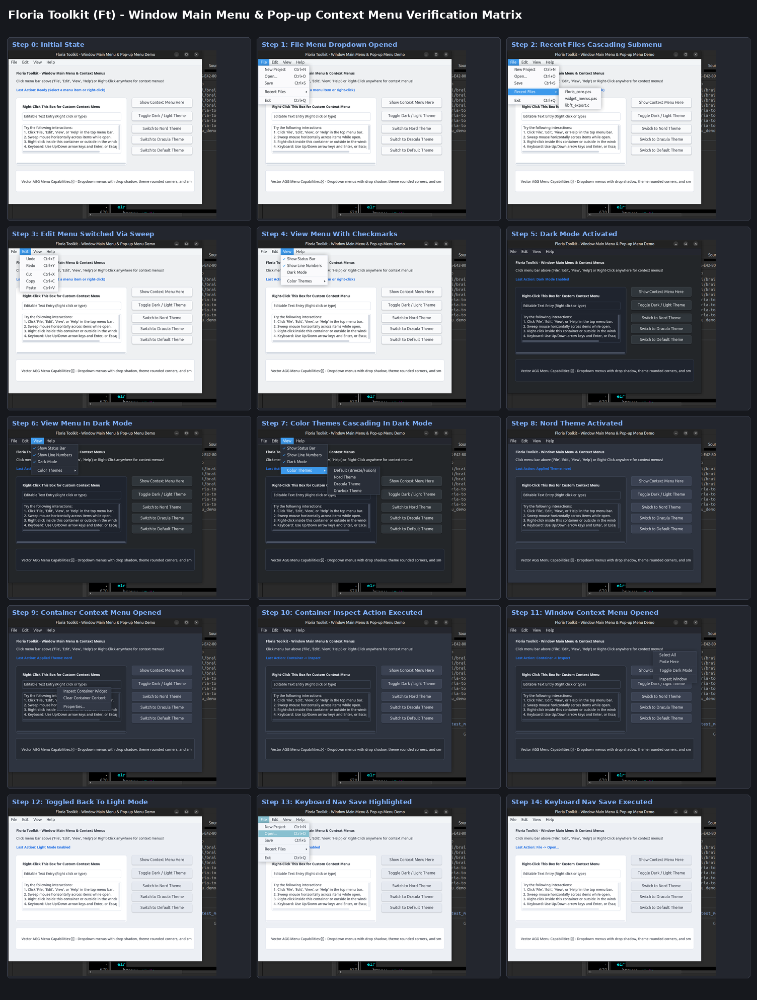
*Comprehensive 15-step verification matrix: Top-level Window Main Menu bar with hover highlights and sweep tracking, cascading submenus nested to arbitrary depths, crisp vector checkmarks (`✓`) and cascade arrows (`▶`), hot-swappable themes in menus (Light, Dark, Nord), widget-level right-click context menus (`TFtContainer`), window-level right-click context menus, and full keyboard navigation (`Alt`, arrows, Enter, Escape).*

### Native Floating Menus Extending Outside Window Bounds
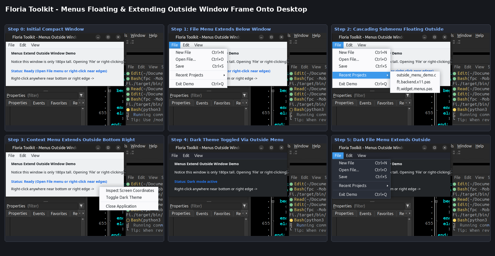
*Native floating popup windows: Menus are created as top-level borderless windows (`_NET_WM_WINDOW_TYPE_POPUP_MENU`) that extend seamlessly past parent window frames onto the desktop. Submenus cascade freely and right-click context menus float unconstrained. Rounded corners and elevation drop shadows are delegated to the native X11 compositor (Picom, Marco, Mutter, KWin).*

### Reusable Container & Scrolled Viewport Showcase (TFtContainer)
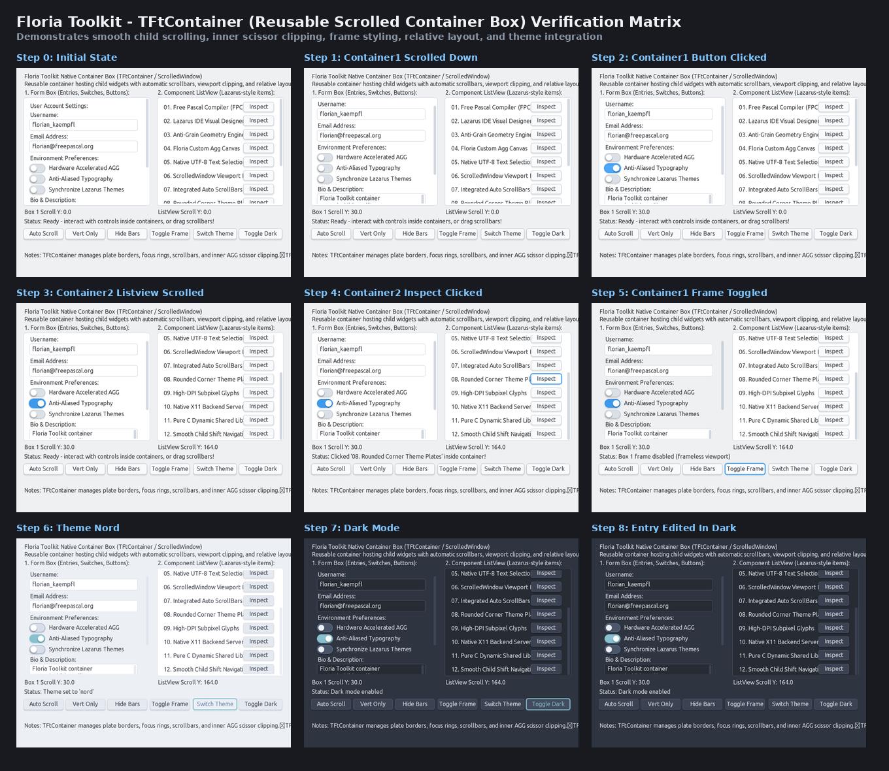
*Reusable `TFtContainer` hosting heterogeneous child widgets (text entries, switches, text areas, action buttons, and Lazarus IDE-style component list items) with relative coordinates, automatic scrollbars, smooth mouse wheel navigation, and subpixel AGG scissor clipping.*

### Native ScrollBar & Scrollable TextArea Showcase
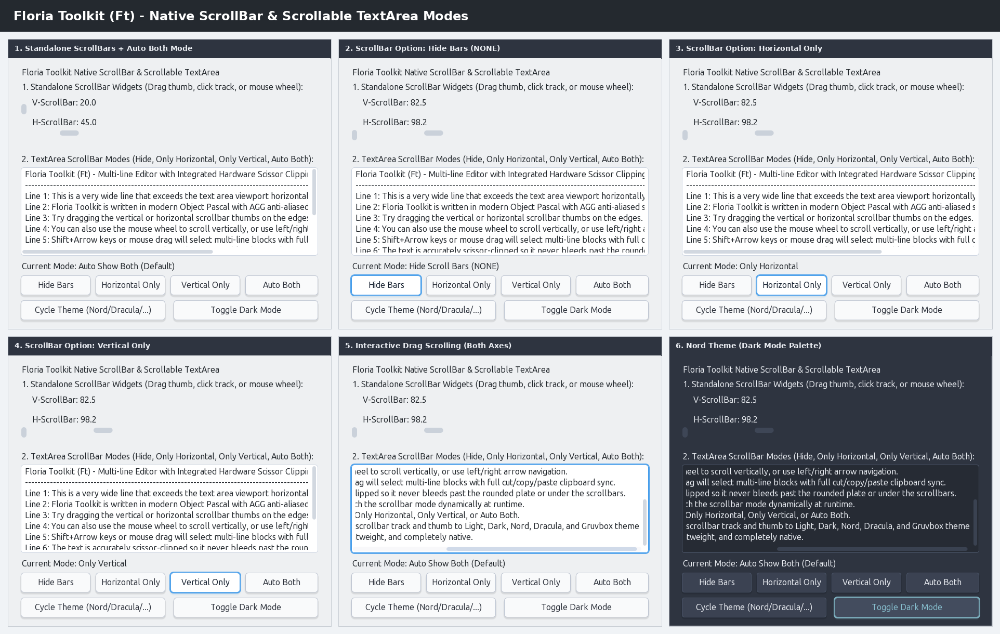
*Standalone ScrollBars (horizontal & vertical) with live drag and track paging callbacks, alongside TextArea exhibiting dynamic scrollbar policy switching (Hide, Horizontal Only, Vertical Only, and Auto Both) and theme adaptation.*

### Native Text Input Showcase (Entry & TextArea)
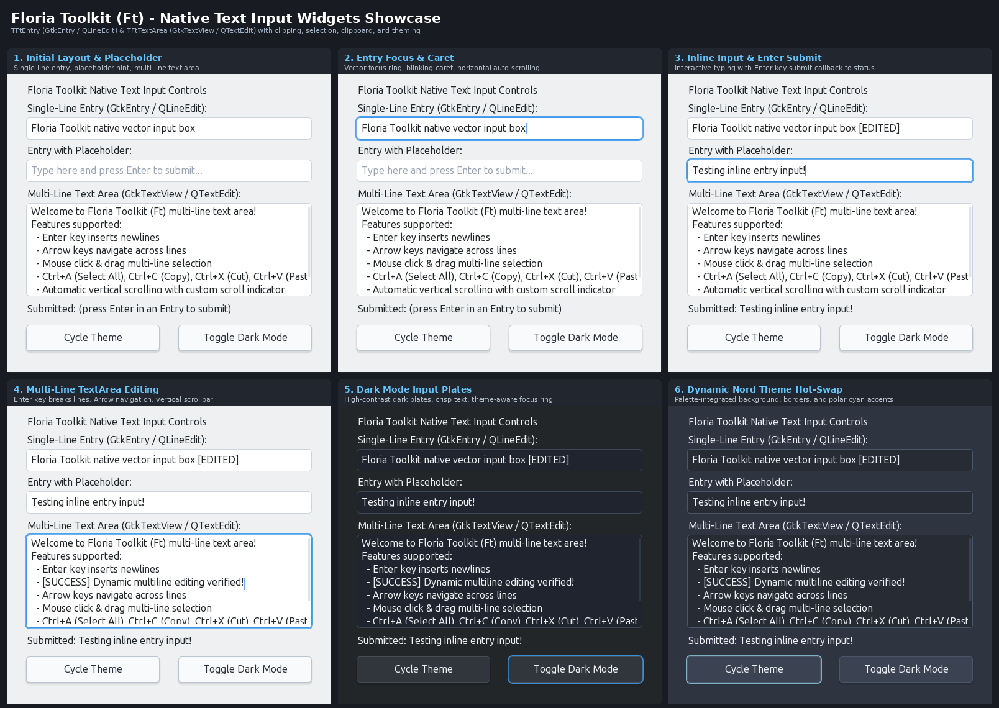
*Single-line Entry (GtkEntry / QLineEdit) with placeholder and Enter submit, alongside multi-line TextArea (GtkTextView / QTextEdit) with vertical scrolling across light, dark, and custom themes.*

### Modern Vector Widgets & Theming
| Default Theme (Light Mode) | Default Theme (Dark Mode) |
| :---: | :---: |
| 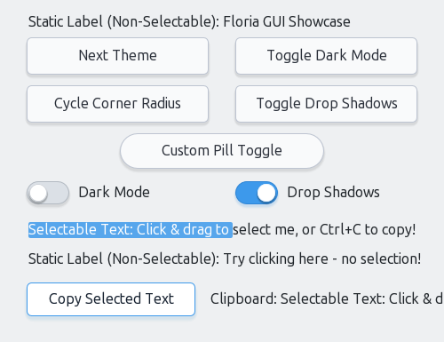 | 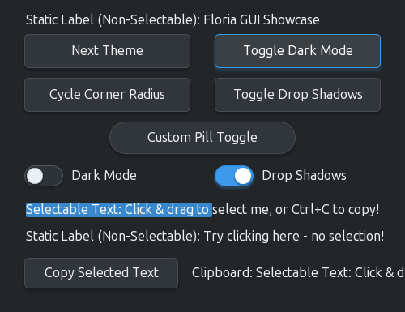 |

| Nord Theme (Dark Mode) | Dracula Theme (Dark Mode) |
| :---: | :---: |
| 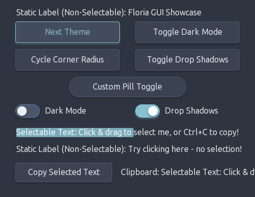 | 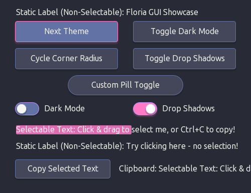 |

### Keyboard Focus & Navigation Showcase (GTK-Style)
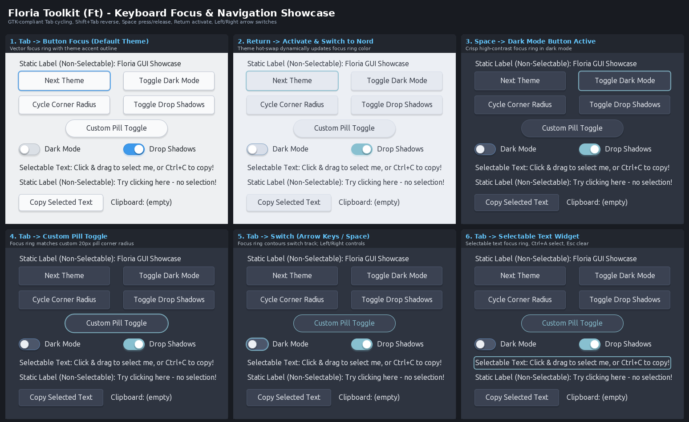
*Full keyboard control and focus ring indicators across button types, custom pill radii, dark mode, toggle switches, and selectable text widgets.*

### Multilingual & Internationalization Showcase
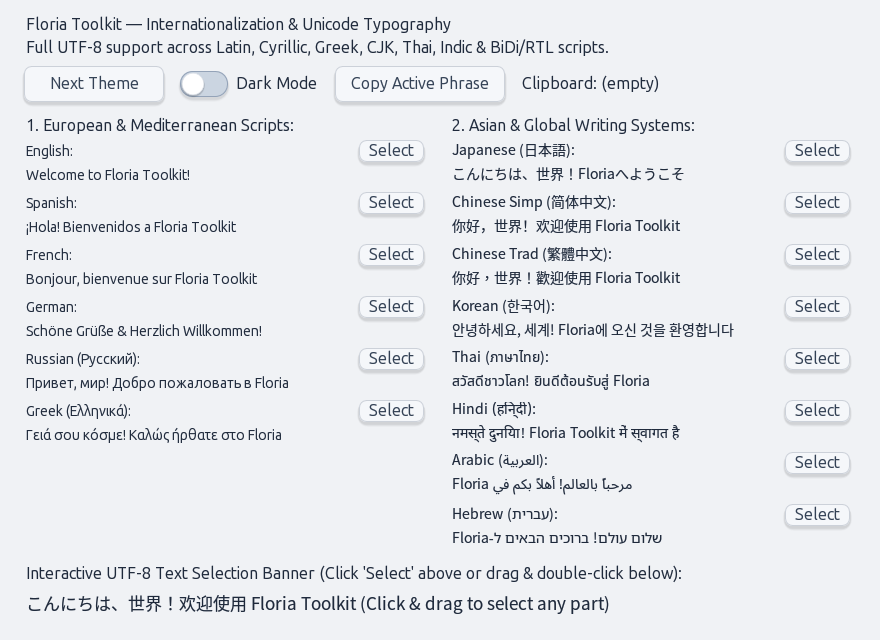
*Full UTF-8 Unicode rendering across 14 languages and writing systems (Latin, Cyrillic, Greek, CJK, Thai, Devanagari, Arabic, Hebrew) with interactive text selection and system clipboard integration.*

### Python CFFI Integration
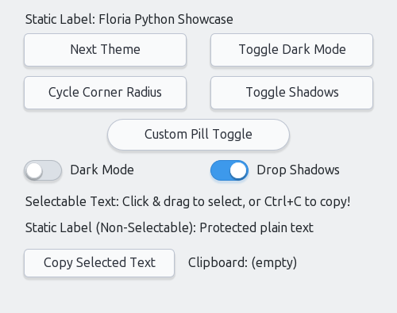
*Python ctypes host running the identical native AGG vector widgets and theming engine.*

---

## Directory Layout

```
floria-toolkit/
├── include/
│   └── ft.h                  # C/C++ API header
├── src/
│   └── main/pascal/
│       ├── ft.pas            # Shared library entry point & C exports
│       ├── ft.backend.x11.pas# X11 window backend & event dispatch loop
│       ├── ft.canvas.agg.pas # AGG 2D vector drawing & shadow pipeline
│       ├── ft.widget.pas         # Base widget abstraction
│       ├── ft.widget.buttons.pas # Button & Toggle Button implementations
│       ├── ft.widget.switches.pas# Modern Switch widget implementation
│       ├── ft.widget.texts.pas   # Text / Label widget with selection & clipboard
│       ├── ft.widget.entries.pas # Single-line text input (GtkEntry / QLineEdit)
│       ├── ft.widget.textareas.pas# Multi-line text area (GtkTextView / QTextEdit)
│       ├── ft.widget.scrollbars.pas# Draggable ScrollBar widget (horizontal & vertical)
│       ├── ft.widget.containers.pas# Reusable Container box (ScrolledWindow / ListView)
│       ├── ft.widget.menus.pas   # Main Menu bar & Pop-up Context Menu (AGG vector)
│       ├── ft.theme.pas      # Theme engine, default theme & file themes
│       └── ft.font.pas       # Font management, DPI scaling & gamma
├── themes/                   # Bundled community & style theme files
│   ├── classic.theme         # Elevated 3D slate with emerald green accents
│   ├── dracula.theme         # Dark fantasy palette with neon pink/purple
│   ├── gruvbox.theme         # Retro warm parchment / dark charcoal
│   ├── gtk2.theme            # Industrial slate & steel gray palette
│   └── nord.theme            # Arctic frosty slate & polar cyan palette
├── examples/
│   ├── c/
│   │   ├── main.c            # Comprehensive C demonstration app
│   │   ├── containers.c      # Reusable container and scrolled viewport demo
│   │   ├── inputs.c          # Single-line entry & multi-line textarea demo
│   │   ├── scrollbars.c      # Standalone scrollbar and policy demo
│   │   ├── multilingual.c    # International UTF-8 text demo
│   │   └── menus.c           # Window Main Menu & Pop-up Context Menu demo
│   └── python/
│       └── app.py            # Python ctypes wrapper & interactive showcase
└── project.xml               # PasBuild package configuration
```

---

## Building & Compiling

### Prerequisites
- **Free Pascal Compiler** (`fpc` 3.2.0+)
- **GCC** or **Clang** (for compiling C examples)
- **Python 3** (for running Python examples)
- **X11 Development Headers** (`libX11`, `libXext`)
- **fpgui-framework** (installed via PasBuild / fpcupdeluxe)

### 1. Build the Shared Library (`libft.so`)

Using `fpc`:

```bash
mkdir -p target/bin/lib/x86_64-linux

fpc -Mobjfpc -Scghi -Cg -O1 -g -gl -vewnhibq \
  -Fi./target/bin/lib/x86_64-linux \
  -Fu./src/main/pascal/ \
  -Fu./3rdparty/fcl-css/src/ \
  -Fu$HOME/.pasbuild/repository/fpgui-framework/2.2.0-SNAPSHOT/x86_64-linux-3.2.3/units \
  -FU./target/bin/lib/x86_64-linux/ \
  -FE./target/bin/ \
  -otarget/bin/libft.so src/main/pascal/ft.pas
```

### 2. Build the C Examples

You can build all C examples at once with the build script:
```bash
./build_examples.sh
```

Or build them individually (make sure to include `-Wl,-rpath,'$ORIGIN'` so the binary can locate `libft.so` regardless of the current working directory):
```bash
gcc -Iinclude -Ltarget/bin -Wl,-rpath,'$ORIGIN',-rpath,'$ORIGIN/..' \
    -o target/bin/c_example examples/c/main.c -lft
```

Run any of the compiled C examples:
```bash
./target/bin/c_example
./target/bin/example_menus
./target/bin/example_containers
./target/bin/example_inputs
./target/bin/example_scrollbars
./target/bin/example_multilingual
```

### 3. Run the Python Examples

General widgets showcase:
```bash
python3 examples/python/app.py
```

Multilingual showcase:
```bash
python3 examples/python/multilingual.py
```

---

## Quickstart

### C Example

```c
#include "ft.h"
#include <stdio.h>

void on_button_click(FtWidget widget, void* user_data) {
    printf("Button clicked! User data: %s\n", (char*)user_data);
}

void on_switch_toggle(FtWidget widget, int32_t checked, void* user_data) {
    printf("Dark Mode is now: %s\n", checked ? "ON" : "OFF");
    ft_theme_set_dark_mode(checked);
}

int main(void) {
    // 1. Initialize toolkit
    ft_init();

    // 2. Create main window (500x320)
    FtWidget win = ft_window_create(500, 320, "Floria Toolkit Quickstart");

    // 3. Add a Button
    FtWidget btn = ft_button_create(win, 30, 40, 200, 44, "Click Me");
    ft_button_on_click(btn, on_button_click, (void*)"MyButton");

    // 4. Add a Switch
    FtWidget sw = ft_switch_create(win, 30, 110, 200, 26, "Dark Mode");
    ft_switch_set_checked(sw, ft_theme_get_dark_mode());
    ft_switch_on_toggle(sw, on_switch_toggle, NULL);

    // 5. Show and start event loop
    ft_widget_show(win);
    ft_main_loop();

    return 0;
}
```

### Python Example (`ctypes`)

```python
import ctypes

# Load Floria Toolkit shared library
ft = ctypes.CDLL("./target/bin/libft.so")

ft.ft_init()
win = ft.ft_window_create(400, 250, b"Python Floria App")

# Create a toggle button
btn = ft.ft_toggle_button_create(win, 50, 50, 180, 40, b"Toggle Me")

# Hot-switch theme to Dracula or Nord
ft.ft_theme_set(b"nord")
ft.ft_theme_set_dark_mode(1)

ft.ft_widget_show(win)
ft.ft_main_loop()
```

---

## Theming System

### Built-in vs. File Themes

- **`default` (Built-in)**:
  - Hardcoded into `TFtThemeDefault` inside the binary for zero external asset requirements.
  - Implements the modern Qt6 / Breeze visual appearance.
  - Supports both Light Mode and Dark Mode.
  - Requesting `'qt6'` automatically resolves to `'default'`.

- **Dynamic Theme Files (`*.theme`)**:
  - Saved as INI-formatted text files inside `themes/` or standard configuration folders.
  - Hot-swappable at runtime without needing application restart.

### Theme File Format

Themes are plain text INI files structured as follows:

```ini
[Theme]
Name=nord
Author=Arctic Ice Studio / Floria Project
Description=Arctic frosty slate palette with polar cyan accents
Style=modern
CornerRadius=4.0
Shadow=true
ShadowOffsetY=2.0
ShadowBlur=4.0
ShadowOpacity=0.18

[Light]
window.bg = #ECEFF4
button.normal.plate = #E5E9F0
button.normal.border = #D8DEE9
button.normal.text = #2E3440
button.hover.plate = #ECEFF4
button.hover.border = #88C0D0
button.hover.text = #88C0D0
button.pressed.plate = #D8DEE9
button.pressed.border = #81A1C1
button.pressed.text = #2E3440
button.toggled.plate = #E5E9F0
button.toggled.border = #88C0D0
button.toggled.indicator = #88C0D0
button.toggled.text = #88C0D0

[Dark]
window.bg = #242933
button.normal.plate = #2E3440
button.normal.border = #3B4252
button.normal.text = #ECEFF4
button.hover.plate = #3B4252
button.hover.border = #88C0D0
button.hover.text = #88C0D0
button.pressed.plate = #242933
button.pressed.border = #81A1C1
button.pressed.text = #ECEFF4
button.toggled.plate = #2E3440
button.toggled.border = #88C0D0
button.toggled.indicator = #88C0D0
button.toggled.text = #88C0D0
```

### Theme Discovery Directories
Floria Toolkit automatically discovers `.theme` files from the following paths:
1. Paths in environment variable `FT_THEME_PATH` (colon separated)
2. `~/.config/floria/themes`
3. `~/.local/share/floria/themes`
4. `/usr/share/floria/themes`
5. `/etc/floria/themes`
6. Local `./themes` directory

---

## API Reference

### Core Lifecycle
| Function | Description |
|---|---|
| `void ft_init(void)` | Initializes the toolkit backend, font subsystem, and theme manager |
| `void ft_main_loop(void)` | Enters the event dispatch loop (blocks until all windows close or `ft_quit`) |
| `void ft_quit(void)` | Terminates the main loop and cleans up toolkit resources |

### Window Management
| Function | Description |
|---|---|
| `FtWidget ft_window_create(int32_t w, int32_t h, const char* title)` | Creates and returns a top-level native window |
| `void ft_window_set_title(FtWidget win, const char* title)` | Sets window title string |
| `void ft_window_set_borderless(FtWidget win, int32_t borderless)` | Enables or disables window manager decorations / titlebar |
| `int32_t ft_window_get_borderless(FtWidget win)` | Returns 1 if window is borderless, 0 otherwise |
| `void ft_window_set_skip_taskbar(FtWidget win, int32_t skip)` | Hides window from taskbar and pager (`_NET_WM_STATE_SKIP_TASKBAR`) |
| `int32_t ft_window_get_skip_taskbar(FtWidget win)` | Returns 1 if skipped from taskbar, 0 otherwise |
| `void ft_window_set_window_type(FtWidget win, int32_t type)` | Sets EWMH window type (`NORMAL`, `DIALOG`, `POPUP_MENU`, `DROPDOWN_MENU`, `TOOLTIP`, `UTILITY`) |
| `int32_t ft_window_get_window_type(FtWidget win)` | Returns current window type |
| `void ft_window_set_position(FtWidget win, int32_t x, int32_t y)` | Explicitly positions window on screen |
| `void ft_window_get_position(FtWidget win, int32_t* x, int32_t* y)` | Queries window's root screen coordinates |
| `void ft_widget_show(FtWidget widget)` | Maps and displays the widget/window on screen |
| `void ft_widget_hide(FtWidget widget)` | Unmaps and hides the widget/window |

### Widget Focus & Keyboard Navigation
| Function | Description |
|---|---|
| `void ft_widget_set_focus(FtWidget widget)` | Programmatically gives keyboard focus to widget (draws theme focus ring) |
| `int32_t ft_widget_has_focus(FtWidget widget)` | Returns `1` if widget currently holds keyboard focus, `0` otherwise |
| `void ft_widget_set_focusable(FtWidget widget, int32_t focusable)` | Sets whether widget can receive focus (`1` = yes, `0` = no; drops focus if currently focused) |
| `int32_t ft_widget_get_focusable(FtWidget widget)` | Returns `1` if widget is focusable, `0` otherwise |

**Keyboard Controls**:
- **`Tab`** / **`Shift+Tab`**: Forward / backward focus traversal through all focusable widgets with wrapping.
- **`Space`**: Presses down on keypress, activates on key release (Button, Toggle Button) or toggles state (Switch).
- **`Return` / `Enter`**: Immediately activates button click or switch toggle.
- **`Left Arrow` / `Right Arrow`**: Direct control on focused switches (Left = turn OFF, Right = turn ON).
- **`Ctrl+A` / `Escape`**: Select all or clear selection on focused selectable text widgets.

### Button Widgets
| Function | Description |
|---|---|
| `FtWidget ft_button_create(parent, x, y, w, h, caption)` | Creates a standard push button |
| `FtWidget ft_toggle_button_create(parent, x, y, w, h, caption)` | Creates a toggleable button |
| `void ft_button_set_toggle(FtWidget btn, int32_t can_toggle)` | Enables or disables toggle mode on a button |
| `void ft_button_set_toggled(FtWidget btn, int32_t toggled)` | Sets toggle state (0 = untoggled, 1 = toggled) |
| `int32_t ft_button_get_toggled(FtWidget btn)` | Queries whether button is toggled |
| `int32_t ft_button_get_state(FtWidget btn)` | Returns button interaction state (`NORMAL`, `HOVERED`, `PRESSED`) |
| `void ft_button_on_click(btn, callback, user_data)` | Registers click callback |
| `void ft_button_on_hover(btn, callback, user_data)` | Registers mouse enter/leave hover callback |
| `void ft_button_on_press(btn, callback, user_data)` | Registers mouse button down/up callback |
| `void ft_button_on_toggle(btn, callback, user_data)` | Registers toggle state change callback |
| `void ft_button_set_corner_radius(btn, double radius)` | Sets per-widget corner radius (`-1.0` to inherit theme) |
| `void ft_button_set_shadow(btn, int32_t enabled)` | Sets per-widget shadow (`-1` to inherit theme, `0` = off, `1` = on) |

### Switch Widgets
| Function | Description |
|---|---|
| `FtWidget ft_switch_create(parent, x, y, w, h, caption)` | Creates a toggle switch widget |
| `void ft_switch_set_checked(FtWidget sw, int32_t checked)` | Sets switch checked state |
| `int32_t ft_switch_get_checked(FtWidget sw)` | Returns 1 if checked, 0 if unchecked |
| `void ft_switch_toggle(FtWidget sw)` | Inverts the switch state |
| `void ft_switch_on_toggle(sw, callback, user_data)` | Registers callback invoked on switch toggle |
| `void ft_switch_set_corner_radius(sw, double radius)` | Sets per-widget corner radius |
| `void ft_switch_set_shadow(sw, int32_t enabled)` | Sets per-widget drop shadow |
| `void ft_switch_set_caption(sw, const char* caption)` | Sets adjacent label text |
| `const char* ft_switch_get_caption(FtWidget sw)` | Gets adjacent label text |

### Text / Label Widgets
| Function | Description |
|---|---|
| `FtWidget ft_text_create(parent, x, y, w, h, text)` | Creates a text/label widget |
| `void ft_text_set_text(FtWidget txt, const char* text)` | Sets the text string |
| `const char* ft_text_get_text(FtWidget txt)` | Retrieves current text string |
| `void ft_text_set_selectable(FtWidget txt, int32_t selectable)` | Enables or disables mouse selection (1 = selectable, 0 = static) |
| `int32_t ft_text_get_selectable(FtWidget txt)` | Queries whether text can be selected |
| `const char* ft_text_get_selected_text(FtWidget txt)` | Returns currently selected substring |
| `void ft_text_select_all(FtWidget txt)` | Programmatically selects all characters |
| `void ft_text_clear_selection(FtWidget txt)` | Clears any active selection |
| `void ft_text_copy(FtWidget txt)` | Copies selected text directly to system clipboard |
| `void ft_text_set_alignment(FtWidget txt, int32_t align)` | Sets alignment (`FT_TEXT_ALIGN_LEFT`, `CENTER`, `RIGHT`) |
| `int32_t ft_text_get_alignment(FtWidget txt)` | Gets current text alignment |
| `void ft_text_set_color(FtWidget txt, double r, g, b)` | Sets custom text color override |
| `void ft_text_reset_color(FtWidget txt)` | Resets text color to follow theme |

### Entry Widgets (Single-Line Inline Input Box / LineEdit)
*Equivalent to `GtkEntry` in GTK and `QLineEdit` in Qt.*

| Function | Description |
|---|---|
| `FtWidget ft_entry_create(parent, x, y, w, h, text)` | Creates a single-line text input box |
| `void ft_entry_set_text(FtWidget entry, const char* text)` | Sets entry text string |
| `const char* ft_entry_get_text(FtWidget entry)` | Retrieves current entry text |
| `void ft_entry_set_placeholder(FtWidget entry, const char* placeholder)` | Sets grayed-out placeholder hint |
| `const char* ft_entry_get_placeholder(FtWidget entry)` | Retrieves placeholder string |
| `void ft_entry_set_readonly(FtWidget entry, int32_t readonly_mode)` | Enables or disables read-only mode |
| `int32_t ft_entry_get_readonly(FtWidget entry)` | Returns 1 if read-only, 0 otherwise |
| `void ft_entry_on_change(entry, callback, user_data)` | Registers text modification callback |
| `void ft_entry_on_submit(entry, callback, user_data)` | Registers callback invoked on Enter/Return key |
| `void ft_entry_set_corner_radius(FtWidget entry, double radius)` | Sets per-widget corner radius |

### TextArea Widgets (Multi-Line Text Area / TextView)
*Equivalent to `GtkTextView` in GTK and `QTextEdit` / `QPlainTextEdit` in Qt.*

| Function | Description |
|---|---|
| `FtWidget ft_textarea_create(parent, x, y, w, h, text)` | Creates a multi-line text area widget of any size |
| `void ft_textarea_set_text(FtWidget ta, const char* text)` | Sets multi-line text string (supports `\n`) |
| `const char* ft_textarea_get_text(FtWidget ta)` | Retrieves complete multi-line text string |
| `void ft_textarea_set_placeholder(FtWidget ta, const char* placeholder)` | Sets placeholder hint shown when empty |
| `const char* ft_textarea_get_placeholder(FtWidget ta)` | Retrieves placeholder string |
| `void ft_textarea_set_readonly(FtWidget ta, int32_t readonly_mode)` | Enables or disables read-only mode |
| `int32_t ft_textarea_get_readonly(FtWidget ta)` | Returns 1 if read-only, 0 otherwise |
| `void ft_textarea_on_change(ta, callback, user_data)` | Registers text modification callback |
| `void ft_textarea_set_corner_radius(FtWidget ta, double radius)` | Sets per-widget corner radius |
| `void ft_textarea_set_scrollbar_mode(FtWidget ta, int32_t mode)` | Sets scrollbar policy (`0`=None, `1`=Horiz, `2`=Vert, `3`=Auto Both) |
| `int32_t ft_textarea_get_scrollbar_mode(FtWidget ta)` | Returns current scrollbar policy |
| `FtWidget ft_textarea_get_vscrollbar(FtWidget ta)` | Returns the internal vertical `FtWidget` scrollbar |
| `FtWidget ft_textarea_get_hscrollbar(FtWidget ta)` | Returns the internal horizontal `FtWidget` scrollbar |

### ScrollBar Widgets (Horizontal & Vertical)
*Draggable vector scrollbar supporting proportional thumb sizing and theme styling.*

| Function | Description |
|---|---|
| `FtWidget ft_scrollbar_create(parent, x, y, w, h, orientation)` | Creates a scrollbar (`0`=Horizontal, `1`=Vertical) |
| `void ft_scrollbar_set_orientation(sb, int32_t orientation)` | Sets orientation (`0`=Horizontal, `1`=Vertical) |
| `int32_t ft_scrollbar_get_orientation(sb)` | Returns current orientation |
| `void ft_scrollbar_set_range(sb, double min, max, page_size)` | Configures range limits and proportional thumb page size |
| `void ft_scrollbar_set_value(sb, double value)` | Sets current position (clamped between min and max) |
| `double ft_scrollbar_get_value(sb)` | Retrieves current position value |
| `double ft_scrollbar_get_min(sb)` | Retrieves minimum range limit |
| `double ft_scrollbar_get_max(sb)` | Retrieves maximum range limit |
| `double ft_scrollbar_get_page_size(sb)` | Retrieves viewport page size |
| `void ft_scrollbar_set_step(sb, double step)` | Sets small wheel step size |
| `double ft_scrollbar_get_step(sb)` | Retrieves small step size |
| `void ft_scrollbar_on_scroll(sb, callback, user_data)` | Registers live scroll notification callback |
| `void ft_scrollbar_set_corner_radius(sb, double radius)` | Sets per-widget corner radius override |

### Container Widgets (Scrollable Box / Viewport Frame)
*Equivalent to `GtkScrolledWindow` in GTK, `QScrollArea` in Qt, and `TScrollBox` in Lazarus LCL.*

| Function | Description |
|---|---|
| `FtWidget ft_container_create(parent, x, y, w, h)` | Creates a reusable container box / viewport frame |
| `void ft_container_set_scrollbar_mode(container, mode)` | Sets scrollbar policy (`0`=None, `1`=Horiz, `2`=Vert, `3`=Auto Both) |
| `int32_t ft_container_get_scrollbar_mode(container)` | Returns current scrollbar policy |
| `void ft_container_set_content_size(container, w, h)` | Explicitly sets virtual content dimensions |
| `void ft_container_get_content_size(container, &w, &h)` | Retrieves virtual content dimensions |
| `void ft_container_set_scroll_pos(container, sx, sy)` | Scrolls container to specific coordinates |
| `double ft_container_get_scroll_x(container)` | Returns current horizontal scroll offset |
| `double ft_container_get_scroll_y(container)` | Returns current vertical scroll offset |
| `void ft_container_set_corner_radius(container, radius)` | Sets per-container corner radius |
| `double ft_container_get_corner_radius(container)` | Returns container corner radius |
| `void ft_container_set_padding(container, pad_x, pad_y)` | Sets inner padding around child widgets |
| `void ft_container_set_draw_frame(container, draw_frame)` | Enables/disables border frame plate rendering (`1`=on, `0`=off) |
| `int32_t ft_container_get_draw_frame(container)` | Queries whether border frame plate is drawn |
| `void ft_container_set_draw_focus_ring(container, draw_ring)`| Enables/disables focus ring around container |
| `int32_t ft_container_get_draw_focus_ring(container)` | Queries whether focus ring is enabled |
| `void ft_container_set_auto_content_size(container, auto_sz)`| Automatically expands content area to fit all children (`1`=on, `0`=off) |
| `int32_t ft_container_get_auto_content_size(container)` | Queries auto content sizing state |
| `FtWidget ft_container_get_vscrollbar(container)` | Returns vertical `FtWidget` scrollbar instance |
| `FtWidget ft_container_get_hscrollbar(container)` | Returns horizontal `FtWidget` scrollbar instance |
| `void ft_container_on_scroll(container, callback, user_data)`| Registers scroll callback |
| `void ft_container_get_client_rect(container, &x, &y, &w, &h)`| Computes inner client viewport area excluding scrollbars |
| `void ft_container_update_scrollbars(container)` | Recalculates scrollbar ranges, visibility, and layout |

### Window Main Menu (TFtMainMenu)
*Top-level horizontal menu bar with hover tracking, sweep activation, and keyboard navigation.*

| Function | Description |
|---|---|
| `FtWidget ft_main_menu_create(FtWidget window)` | Creates a main menu bar and attaches it to the window |
| `FtWidget ft_main_menu_add_menu(main_menu, caption)` | Adds a top-level menu column (e.g. `"File"`) and returns its popup menu |
| `FtMenuItem ft_main_menu_add_item(main_menu, caption, popup)`| Adds an existing popup menu as a top-level menu |
| `int32_t ft_main_menu_item_count(main_menu)` | Returns number of top-level menus |
| `FtMenuItem ft_main_menu_get_item(main_menu, index)` | Retrieves top-level menu item at index |
| `void ft_main_menu_close(main_menu)` | Closes any open dropdown menu |

### Pop-up & Context Menus (TFtPopupMenu)
*Floating vector popup menu with shadows, rounded plates, checkmarks, and cascading submenus.*

| Function | Description |
|---|---|
| `FtWidget ft_popup_menu_create(FtWidget parent)` | Creates a standalone popup menu |
| `FtMenuItem ft_popup_menu_add_item(popup, caption, cb, data)` | Appends an interactive menu item with callback |
| `FtMenuItem ft_popup_menu_add_check_item(popup, caption, checked, cb, data)` | Appends a toggleable checkmark item |
| `FtMenuItem ft_popup_menu_add_separator(popup)` | Appends a horizontal theme separator line |
| `FtMenuItem ft_popup_menu_add_submenu(popup, caption, submenu)` | Appends a cascading child submenu (`▶`) |
| `int32_t ft_popup_menu_item_count(popup)` | Returns item count in menu |
| `FtMenuItem ft_popup_menu_get_item(popup, index)` | Retrieves menu item at index |
| `void ft_popup_menu_show(popup, int32_t x, int32_t y)` | Opens popup menu at window coordinates `(x, y)` |
| `void ft_popup_menu_close(popup)` | Closes popup menu and any active submenus |
| `void ft_popup_menu_clear(popup)` | Removes all items from the popup menu |
| `void ft_popup_menu_set_corner_radius(popup, radius)` | Sets corner radius override for menu plate |

### Menu Items (TFtMenuItem)
*Individual menu entry supporting captions, keyboard shortcuts, checkmarks, submenus, and tags.*

| Function | Description |
|---|---|
| `void ft_menu_item_set_caption(item, caption)` | Sets item text (use `"-"` for separator) |
| `const char* ft_menu_item_get_caption(item)` | Gets item text |
| `void ft_menu_item_set_shortcut(item, shortcut)` | Sets right-aligned shortcut hint (e.g. `"Ctrl+S"`) |
| `const char* ft_menu_item_get_shortcut(item)` | Gets shortcut hint |
| `void ft_menu_item_set_enabled(item, enabled)` | Enables (`1`) or disables (`0`) menu item |
| `int32_t ft_menu_item_get_enabled(item)` | Returns 1 if enabled, 0 if disabled |
| `void ft_menu_item_set_checked(item, checked)` | Sets checked state (`1` = checked, `0` = unchecked) |
| `int32_t ft_menu_item_get_checked(item)` | Returns checked state |
| `void ft_menu_item_set_checkable(item, checkable)` | Enables or disables checkable mode |
| `int32_t ft_menu_item_get_checkable(item)` | Returns 1 if item can toggle check state |
| `void ft_menu_item_set_submenu(item, submenu)` | Attaches a cascading child `TFtPopupMenu` |
| `FtWidget ft_menu_item_get_submenu(item)` | Returns attached child submenu or `NULL` |
| `void ft_menu_item_on_click(item, callback, user_data)` | Registers item click handler |
| `void ft_menu_item_set_tag(item, int64_t tag)` | Attaches user integer/pointer tag |
| `int64_t ft_menu_item_get_tag(item)` | Retrieves user tag |

### Context Menu & Window Attachment
| Function | Description |
|---|---|
| `void ft_widget_set_context_menu(widget, popup_menu)` | Attaches right-click context menu to any widget |
| `FtWidget ft_widget_get_context_menu(widget)` | Returns attached context menu of widget |
| `void ft_window_set_context_menu(window, popup_menu)` | Attaches default right-click context menu to window |
| `FtWidget ft_window_get_context_menu(window)` | Returns attached context menu of window |
| `void ft_window_set_main_menu(window, main_menu)` | Sets active top-level main menu on window |
| `FtWidget ft_window_get_main_menu(window)` | Returns main menu of window |

> [!NOTE]
> `TFtEntry`, `TFtTextArea`, and selectable `TFtText` provide built-in dynamic right-click context menus:
> - Items: **Select All**, separator, **Cut**, **Copy**, **Paste**, **Delete**.
> - **Selectable Text** and **Read-Only Entry / TextArea**: automatically disables and greys out **Cut**, **Delete**, and **Paste**.
> - **Copy** is enabled whenever a selection is present; **Select All** is enabled when text exists; **Paste** is enabled when text is on the clipboard.
> - Non-selectable text labels automatically bubble right-click events up to their parent container or window context menu.
> - Explicitly attaching a context menu with `ft_widget_set_context_menu()` takes precedence over the default menu.

### Clipboard Management
| Function | Description |
|---|---|
| `void ft_clipboard_set_text(const char* text)` | Stores text in system and X11 clipboard |
| `const char* ft_clipboard_get_text(void)` | Retrieves text from system clipboard |

### Theme & Styling Management
| Function | Description |
|---|---|
| `int32_t ft_theme_set(const char* name)` | Switches active theme (`"default"`, `"nord"`, `"dracula"`, etc.) |
| `const char* ft_theme_get(void)` | Returns the name of the currently active theme |
| `const char* ft_theme_get_available(void)` | Returns comma-separated list of available themes |
| `void ft_theme_set_dark_mode(int32_t enabled)` | Sets dark mode state (0 = light, 1 = dark) |
| `int32_t ft_theme_get_dark_mode(void)` | Returns 1 if dark mode is active, 0 otherwise |
| `void ft_theme_set_corner_radius(double radius)` | Sets global theme corner radius (`-1.0` for theme preset) |
| `double ft_theme_get_corner_radius(void)` | Returns current global corner radius |
| `void ft_theme_set_shadow(int32_t enabled)` | Enables or disables drop shadows globally |
| `int32_t ft_theme_get_shadow(void)` | Returns 1 if shadows are enabled, 0 otherwise |
| `int32_t ft_theme_load_file(const char* filepath)` | Loads a `.theme` file directly |
| `int32_t ft_theme_load_dir(const char* dirpath)` | Loads all `.theme` files found in a directory |

### Typography & Display
| Function | Description |
|---|---|
| `const char* ft_system_font_get(void)` | Returns active system font name |
| `void ft_system_font_set(const char* font_desc)` | Sets font family and size |
| `double ft_screen_dpi_get(void)` | Returns detected or configured screen DPI |
| `void ft_screen_dpi_set(double dpi)` | Overrides screen DPI for scaling |
| `double ft_font_gamma_get(void)` | Returns current subpixel font gamma value |
| `void ft_font_gamma_set(double gamma)` | Configures font antialiasing gamma |

---

## License

Floria Toolkit is licensed under the [Mozilla Public License 2.0 (MPL-2.0)](LICENSE).
Copyright (c) Floria Project / Dio Affriza.
