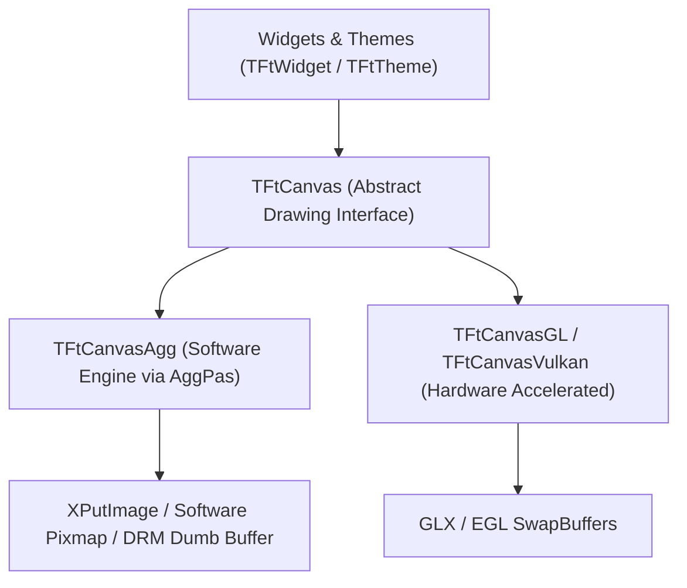

# Floria Toolkit (`Ft`) Roadmap

This document outlines the architectural vision, technical milestones, and future development priorities for the **Floria Toolkit**.

The primary mission of Floria Toolkit is to serve as a fast, modular, and beautiful foundation for building an **X11 Desktop Environment and Window Manager (comparable to KDE/KWin and GNOME/Mutter)**, alongside powering rich standalone desktop applications.

---

## 1. Pluggable Graphics Engine & GPU Acceleration

Floria Toolkit currently utilizes **Anti-Grain Geometry (`AggPas`)** for pure CPU subpixel vector rasterization. Moving forward, the graphics pipeline will evolve into a pluggable multi-backend architecture that pairs high-performance GPU hardware acceleration with AggPas as an indispensable, reliable software fallback.

### Architectural Blueprint

### Key Milestones

- [ ] **Canvas Abstraction (`TFtCanvas`)**:
  - Extract a unified base class/interface defining standard 2D vector drawing primitives (`DrawRect`, `DrawRoundedRect`, `DrawShadow`, `DrawText`, `PushClipRect`, `PopClipRect`).
  - Refactor `TFtWidget` and `TFtTheme` to render strictly against `TFtCanvas`, making all controls agnostic to the underlying rasterization engine.
- [ ] **GPU Acceleration Backends**:
  - **OpenGL / GLES (`TFtCanvasGL`)**: Hardware-accelerated batch rendering using vertex arrays, texture atlasing, and GLSL shaders.
  - **Vulkan (`TFtCanvasVulkan`)**: Modern low-overhead graphics pipeline with explicit memory management and multi-threaded command buffer generation.
- [ ] **AggPas as First-Class Software Fallback & Reference Engine**:
  - AggPas will **not** be deprecated. It serves as:
    - **Universal Fallback**: Automatic graceful fallback when GPU drivers are missing, incompatible, or crash (e.g., virtual machines, legacy hardware, remote VNC/X11 forwarding).
    - **Headless & CI/CD**: Deterministic pixel-accurate rendering for automated testing and server-side screenshot generation without an active GPU or display server.
    - **Asset & Glyph Pre-Rasterizer**: High-quality CPU-side glyph atlas generation and complex SVG path pre-processing before uploading to GPU textures.
    - **Low-Power Embedded**: Zero-GPU, battery-preserving execution for resource-constrained embedded systems.
- [ ] **Dynamic Runtime Backend Negotiation**:
  - Auto-probe GPU capabilities at initialization (`ft_init()`) with seamless fallback to AggPas.
  - User override via environment variables (`FT_RENDERER=software|opengl|vulkan`) and programmatic API configuration.

---

## 2. X11 Desktop Environment & Window Manager (DE/WM) Infrastructure

The primary objective of Floria Toolkit is providing complete, first-class infrastructure to build a modern X11 Desktop Environment and Window Manager (comparable to KDE and GNOME).

### Core DE/WM Milestones:

- [ ] **Window Manager Core (WM)**:
  - **Substructure Redirection**: Acquiring `SubstructureRedirectMask` and `SubstructureNotifyMask` on the root window to intercept client window lifecycle events.
  - **Frame Reparenting**: Reparenting client windows into decorated Floria frames featuring titlebars, [`TFtWindowButton`](include/ft.h#L107) controls (close, minimize, maximize/restore, shade, pin), and resize gutters.
  - **ICCCM & EWMH/NetWM Compliance**: Full compliance with standard window manager protocols (`_NET_WM_STATE`, `_NET_ACTIVE_WINDOW`, `_NET_CLIENT_LIST`, `_NET_WM_DESKTOP`, `_NET_NUMBER_OF_DESKTOPS`, `_NET_WORKAREA`).
  - **Window State Lifecycle**: Handling Minimize/Iconify, Maximize (horizontal/vertical), Restore, Shade/Rollup, Fullscreen, and Pin/Sticky across multiple virtual desktops.
  - **Window Geometry & Interactive Resizing**: Client aspect-ratio constraints, minimum/maximum size hints (`WM_NORMAL_HINTS`), and interactive window moving/resizing routines.
- [ ] **Desktop Shell Components**:
  - **Panels & Docks**: Dedicated panel windows (`_NET_WM_WINDOW_TYPE_DOCK`) with desktop edge reservations via partial struts (`_NET_WM_STRUT_PARTIAL`).
  - **Desktop Surface**: Root desktop wallpaper rendering, desktop icon layout grid, rubberband multi-selection, and folder launch integration.
  - **Taskbar & Window Pager**: Active window indicators, minimized window grouping, live window title updates, and virtual workspace switcher.
  - **Application Launcher**: Searchable popup grid/list launcher reading Freedesktop `.desktop` files, categories, and icon themes.
  - **System Tray**: XEmbed system tray specification (`_NET_SYSTEM_TRAY`) and modern D-Bus StatusNotifierItem (SNI) protocol support.
  - **Window Switcher (Alt+Tab)**: Modal on-screen switcher overlay displaying running application icons, window titles, and live thumbnails.
- [ ] **Compositor & Visual Effects**:
  - **XComposite & XDamage**: Offscreen client window rendering redirection via `XCompositeRedirectSubwindows` and dirty region updates via `XDamage`.
  - **Compositing Engine**: Real-time window drop shadows, rounded client frame corners, smooth window opening/closing animations, and backdrop blur.

---

## 3. Host Platform Backends (Standalone Applications)

Support running standalone Floria Toolkit GUI applications across desktop operating systems:

- [ ] **Windows Platform Backend**:
  - Native Win32 window creation, event dispatch, and message pump.
  - Direct2D / WGL GPU surfaces alongside AggPas GDI DIB blitting.
- [ ] **macOS Platform Backend**:
  - Cocoa window management via Objective-C runtime bridge.
  - Metal / OpenGL context rendering and CoreAnimation layer integration.

---

## 4. Advanced Widget Ecosystem

Enrich the desktop control catalog with complex data-driven components:

- [x] **DataGrid & Table View (`TFtGrid` / `TFtTable`)**:
  - Column headers with alignment (`taLeft`, `taCenter`, `taRight`).
  - Alternating zebra striping, gridlines, and cell selection.
- [ ] **Virtualized Data Grid (`TFtVirtualGrid` / `TFtVirtualTable`)**:
  - **Zero Idle CPU Waste (0% Idle)**: Pure event-driven rendering pipeline that sleeps when motionless; during scrolling, dirty region tracking invalidates only moving rows/columns without wasteful whole-window redraws.
  - **Visible Bounds Virtualization**: Calculates visible row and column slices strictly from scroll viewport offsets (`ScrollX`, `ScrollY`), never instantiating or measuring offscreen items. Capable of effortlessly scrolling 1,000,000+ data rows with flat O(1) memory overhead.
  - **Reusable "Cell Stamp" Flyweight Pattern**: Instead of creating thousands of heavy `FtWidget` instances for every data cell, employs a single reusable "Cell Stamp" layout and paints the data dynamically as the user scrolls, eliminating memory churn and allocation overhead.
  - **Pluggable Data Source Adapter**: Callback-driven model (`OnGetRowCount`, `OnGetCellText`, `OnGetCellCustomDraw`) supporting real-time streaming data, SQL result sets, and async data fetchers.
  - **In-Place Dynamic Cell Editors**: Spawns or overlays lightweight active editors (text entries, checkboxes, dropdowns) exclusively on the currently focused or edited cell, dismissing them back to the flyweight state upon commit/cancel.
- [x] **Tree View (`TFtTreeView`)**:
  - Hierarchical node rendering with folding glyphs, depth indentation, and selection tracking.
- [x] **Notebook / Tabbed Container (`TFtNotebook` / `TFtTabs`)**:
  - Tab switching, close buttons, active tab indicator, and page containers.
- [x] **Splitter & Panes (`TFtSplitter`)**:
  - Resizable horizontal and vertical dividing gutters with live mouse drag, grip dots, and child positioning.
- [ ] **Standard Dialog System**:
  - Native and themed modal dialogs: File Chooser, Directory Selector, Color Picker, and Alert/Confirmation dialogs (`ft_message_box`).
- [ ] **Keyboard Tab Traversal & Accelerators**:
  - Automatic Tab & Shift+Tab focus navigation between focusable widgets.
  - Menu mnemonics (`Alt+F`) and global keyboard accelerator tables.

---

## 5. Typography, Text Shaping & Internationalization (i18n)

Elevate text handling to meet global typography standards:

- [x] **Core BiDi Algorithm Engine (`florialib` / `Floria.Unicode.BiDi`)**:
  - Pure Pascal implementation of the Unicode Bidirectional Algorithm (UAX #9).
  - Paragraph embedding level resolution, weak/neutral classification, bracket pairing, glyph mirroring, and visual run segmentation (`TFloriaBiDiRun`).
- [x] **Dynamic HarfBuzz Text Shaping Engine (`florialib` / `Floria.Text.HarfBuzz`)**:
  - Dynamic runtime loading of `libharfbuzz.so.0` via `dynlibs` (zero hard binary dependency; falls back gracefully to 1:1 character metrics if unavailable).
  - OpenType GSUB & GPOS shaping: ligatures (`liga`, `calt`), cursive Arabic joining, Indic conjuncts & reordering, Thai tone mark stacking, and kerning.
  - Integration with `Floria.Unicode.BiDi` to shape unidirectional runs with explicit visual direction (`HB_DIRECTION_LTR`, `HB_DIRECTION_RTL`).
- [ ] **Toolkit Text Widget Integration**:
  - Wire shaped glyph rendering (`TFloriaShapedGlyph`) into `TFtText`, `TFtEntry`, and `TFtTextArea` rasterization pipelines.
  - BiDi-aware text selection, caret placement, and visual vs. logical cursor navigation (`Left`/`Right` arrows).
- [ ] **Input Method Editor (IME)**:
  - Integration with `ibus`, `fcitx5`, and native platform IMEs for East Asian languages (CJK) composition.

---

## 6. Accessibility & System Integration

- [ ] **Accessibility (a11y)**:
  - AT-SPI2 bridge on Linux for screen readers (Orca) and assistive technologies.
- [ ] **Desktop Notifications**:
  - Freedesktop notification daemon integration for system toasts.
- [ ] **Clipboard & Drag-and-Drop (DND)**:
  - Rich MIME type clipboard negotiation and cross-application drag-and-drop (XDnD).

---

## 7. Toolchain Evolution & Migration to Blaise Compiler

Floria Toolkit currently compiles with Free Pascal (`fpc`) managed via **PasBuild**. The strategic compiler roadmap includes migrating the toolkit and its core helper library (`florialib`) to the **Blaise Compiler** (`blaise`), Graeme Geldenhuys's modern Pascal compiler, aligning language cleanliness, high-performance compilation, and native PasBuild ecosystem integration.

### Migration Milestones:

- [ ] **Language & Syntax Modernization**:
  - Enforce strict routine syntax rules across all units (including mandatory empty parentheses `()` on all zero-parameter declarations and call sites, already underway).
  - Cleanly decouple from FPC-specific dialects and compiler directives (`{$mode objfpc}`, `{$H+}`) toward clean Blaise language constructs.
  - Audit record layout, dynamic arrays, and memory management semantics under the Blaise runtime model.
- [ ] **Core Subsystem & Dependency Porting**:
  - Port `florialib` units (`Floria.CSS`, `Floria.SVG`, `Floria.XCB`, `Floria.X11`) to compile cleanly under Blaise.
  - Port and validate `AggPas` subpixel vector rasterizer routines and 2D math algorithms.
- [ ] **Universal C ABI & Shared Library (`libft.so`) Verification**:
  - Ensure Blaise shared library export capabilities generate fully compliant ELF shared objects (`libft.so`) preserving the exact C ABI defined in [`include/ft.h`](include/ft.h).
  - Validate that foreign language bindings (C, C++, Python `ctypes`, Rust, Zig, Go) require zero code changes.
- [ ] **PasBuild Build Profile & Test Automation**:
  - Configure `project.xml` build configurations for native Blaise compilation.
  - Transition unit test runners from FPCUnit to the Blaise test runner framework.
  - Support a dual-compiler transitional pipeline ensuring continuous verification under both compilers during migration.
