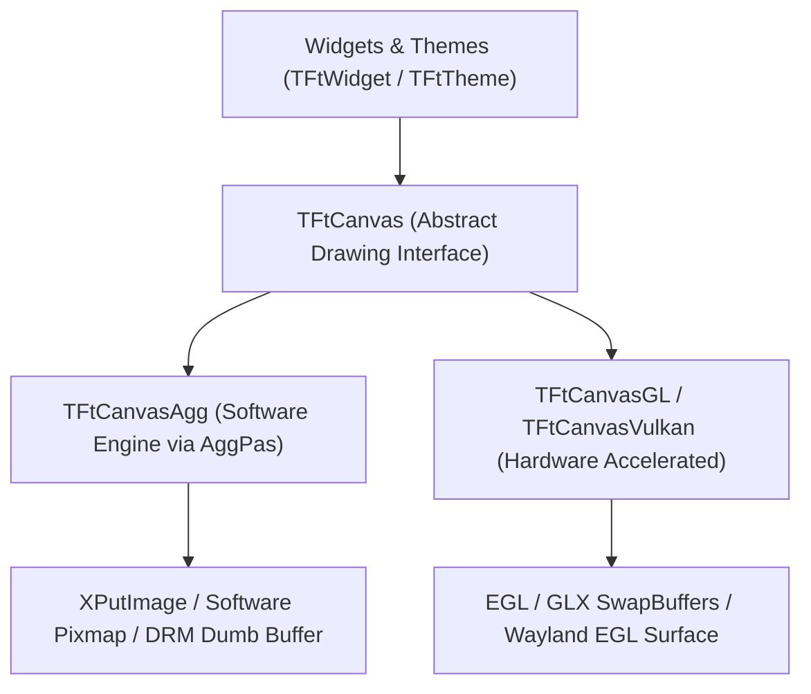

# Floria Toolkit (`Ft`) Roadmap

This document outlines the architectural vision, technical milestones, and future development priorities for the **Floria Toolkit**.

---

## 1. Pluggable Graphics Engine & GPU Acceleration

Floria Toolkit currently utilizes **Anti-Grain Geometry (`AggPas`)** for pure CPU subpixel vector rasterization. Moving forward, the graphics pipeline will evolve into a pluggable multi-backend architecture that pairs high-performance GPU hardware acceleration with AggPas as an indispensable, reliable software fallback.

### Architectural Blueprint

### Key Milestones

- [ ] **Canvas Abstraction (`TFtCanvas`)**:
  - Extract a unified base class/interface defining standard 2D vector drawing primitives (`DrawRect`, `DrawRoundedRect`, `DrawShadow`, `DrawText`, `PushClipRect`, `PopClipRect`).
  - Refactor `TFtWidget` and `TFtTheme` to render strictly against `TFtCanvas`, making all controls agnostic to the underlying rasterization engine.
- [ ] **GPU Acceleration Backends**:
  - **OpenGL / GLES (`TFtCanvasGL`)**: Hardware-accelerated batch rendering using vertex arrays, texture atlasing, and GLSL shaders.
  - **Vulkan (`TFtCanvasVulkan`)**: Modern low-overhead graphics pipeline with explicit memory management and multi-threaded command buffer generation.
- [ ] **AggPas as First-Class Software Fallback & Reference Engine**:
  - AggPas will **not** be deprecated. It serves as:
    - **Universal Fallback**: Automatic graceful fallback when GPU drivers are missing, incompatible, or crash (e.g., virtual machines, legacy hardware, remote VNC/X11 forwarding).
    - **Headless & CI/CD**: Deterministic pixel-accurate rendering for automated testing and server-side screenshot generation without an active GPU or display server.
    - **Asset & Glyph Pre-Rasterizer**: High-quality CPU-side glyph atlas generation and complex SVG path pre-processing before uploading to GPU textures.
    - **Low-Power Embedded**: Zero-GPU, battery-preserving execution for resource-constrained embedded systems.
- [ ] **Dynamic Runtime Backend Negotiation**:
  - Auto-probe GPU capabilities at initialization (`ft_init()`) with seamless fallback to AggPas.
  - User override via environment variables (`FT_RENDERER=software|opengl|vulkan`) and programmatic API configuration.

---

## 2. Multi-Platform & Display Server Backends

Expand beyond native X11 to support contemporary display protocols and operating systems.

- [ ] **Wayland Native Backend**:
  - Direct integration via `libwayland-client` and `xdg-shell`.
  - Wayland subsurfaces for high-performance popups, tooltips, and dropdown menus.
  - Support for `wl_shm` (AggPas software buffer) and EGL (GPU).
- [ ] **Windows Platform Backend**:
  - Native Win32 window creation and message pump.
  - Direct2D / WGL GPU surfaces alongside AggPas GDI DIB blitting.
- [ ] **macOS Platform Backend**:
  - Cocoa window management via Objective-C runtime bridge.
  - Metal / OpenGL context rendering and CoreAnimation layer integration.

---

## 3. Advanced Widget Ecosystem

Enrich the desktop control catalog with complex data-driven components.

- [ ] **DataGrid & Table View (`TFtGrid` / `TFtTable`)**:
  - Virtual scrolling for datasets with millions of rows.
  - Sortable columns, custom cell renderers, and in-place editing.
- [ ] **Tree View (`TFtTreeView`)**:
  - Hierarchical node rendering with folding animations and multi-selection.
- [ ] **Notebook / Tabbed Container (`TFtNotebook` / `TFtTabs`)**:
  - Movable tabs, close buttons, and lazy-loaded page switching.
- [ ] **Splitter & Panes (`TFtSplitter`)**:
  - Resizable horizontal and vertical dividing gutters with minimum size constraints.
- [ ] **Standard Dialog System**:
  - Native and themed modal dialogs: File Chooser, Directory Selector, Color Picker, and Alert/Confirmation dialogs.

---

## 4. Typography, Text Shaping & Internationalization (i18n)

Elevate text handling to meet global typography standards.

- [ ] **HarfBuzz Text Shaping Integration**:
  - Full support for complex and connecting scripts (Arabic, Devanagari, Thai, etc.).
- [ ] **Bidirectional Text (BiDi)**:
  - Unicode BiDi algorithm support for right-to-left (RTL) reading orders.
- [ ] **Input Method Editor (IME)**:
  - Integration with `ibus`, `fcitx5`, and native platform IMEs for East Asian languages (CJK) composition.

---

## 5. Accessibility & System Integration

- [ ] **Accessibility (a11y)**:
  - AT-SPI2 bridge on Linux for screen readers (Orca) and assistive technologies.
- [ ] **System Tray & Desktop Notifications**:
  - StatusNotifierItem / AppIndicator support for background tray icons and system notifications.
- [ ] **Clipboard & Drag-and-Drop (DND)**:
  - Rich MIME type clipboard negotiation and cross-application drag-and-drop.
